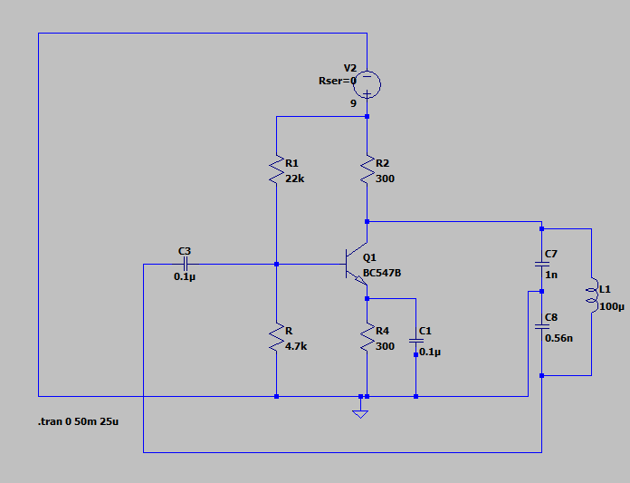
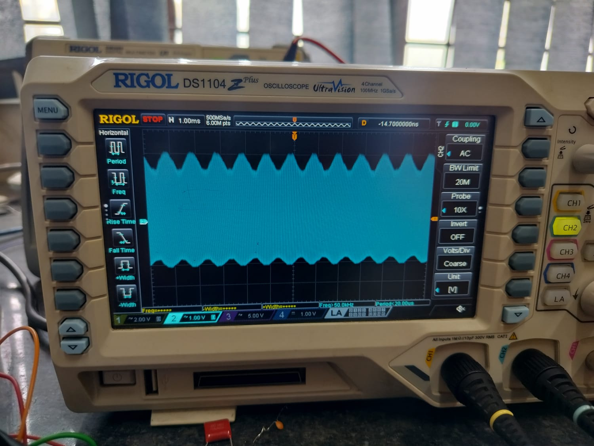
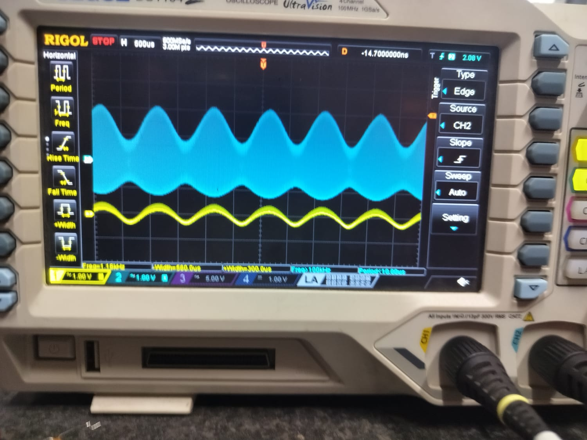
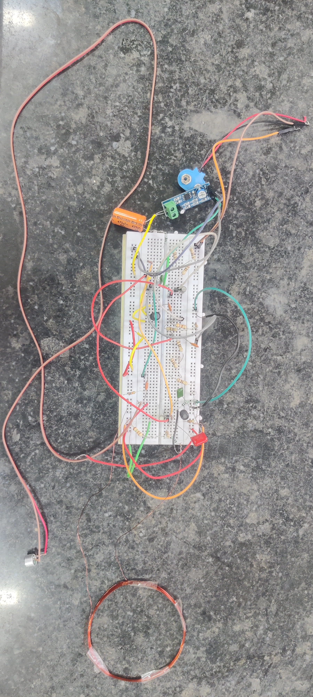
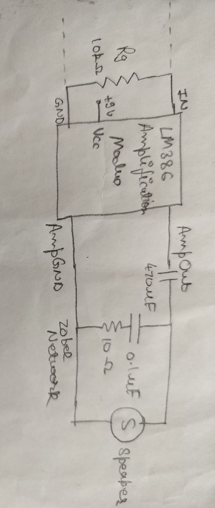
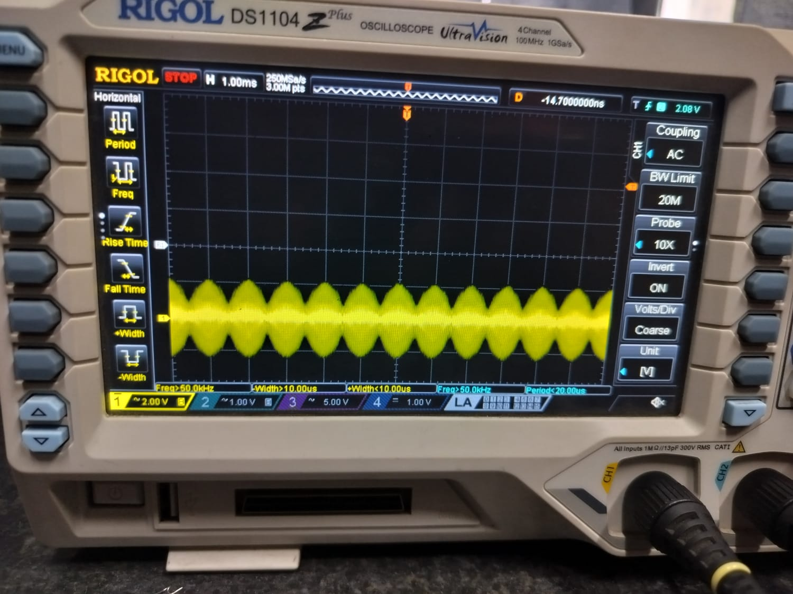
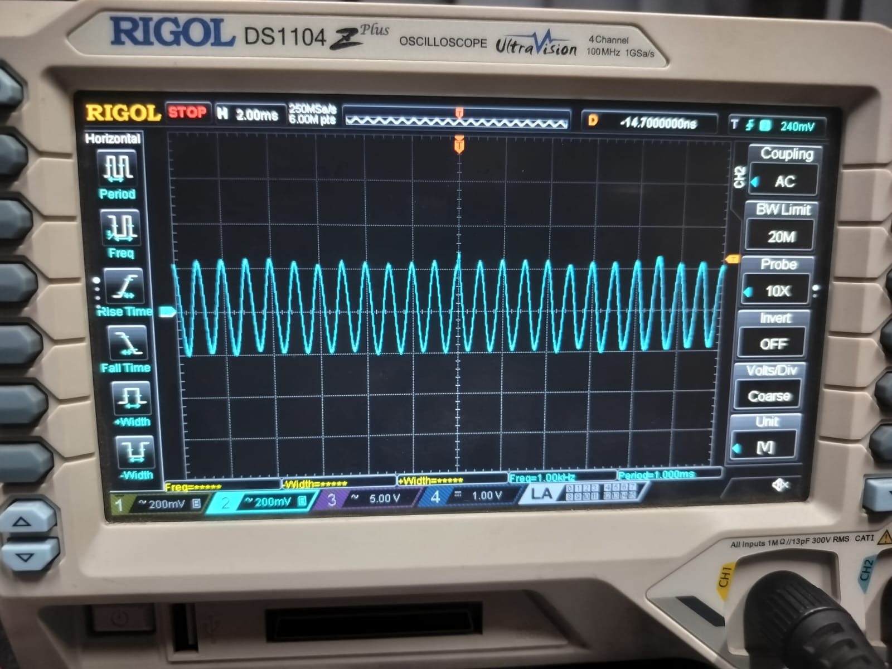

# Design and Implementation of a Discrete Analog AM Audio Transmitter and Receiver with Near-Field Wireless Coupling

## Project Overview

This project involves the design, implementation, and experimental validation of an amplitude modulation (AM) based wireless audio transmitter and receiver using discrete analog components.

The objective of this project was to generate a high-frequency carrier wave, modulate it with an audio information signal, wirelessly transmit the modulated signal, and recover the original signal at the receiver.

During practical testing, it was observed that the dominant mode of wireless communication was **near-field magnetic coupling (inductive coupling)** rather than efficient far-field electromagnetic radiation.

This project provides practical understanding of analog communication systems, oscillator design, modulation techniques, inductive coupling, and real-world hardware debugging challenges.

---

# Technical Rationale and Architectural Significance

The project does not rely on pre-built RF transmitter modules or communication ICs.

Instead, all stages including carrier generation, modulation, transmission, reception, and demodulation were designed and experimentally validated using discrete analog circuitry.

The project experimentally demonstrates:

- High-frequency carrier generation
- Analog amplitude modulation
- Wireless inductive signal transfer
- Envelope detection
- Oscilloscope-based waveform verification

---

# System Architecture

The system consists of four major functional blocks:

1. Carrier Generation Unit  
2. Audio Generation and Amplification Unit  
3. Modulation and Wireless Transmission Unit  
4. Signal Reception and Demodulation Unit  

---

# Carrier Generation Unit

A Colpitts oscillator was designed using a transistor, capacitive divider network, and LC tank circuit.

The oscillation frequency is determined by:

f = 1 / (2π√LC)

Using the selected component values, the practical carrier frequency was observed to be approximately **838 kHz**.

This carrier wave forms the basis of amplitude modulation.

### Oscillator Circuit Diagram

### Observed Carrier Waveform

The oscillator output was verified using an oscilloscope.

---

# Audio Generation and Amplification Unit

An electret microphone was used as the audio input source.

The signal was amplified using an LM386 amplifier stage to generate sufficient modulation drive.

### Audio Amplification Block Diagram

---

# Modulation and Wireless Transmission Unit

The carrier wave was amplitude modulated by varying transistor gain using the amplified audio signal.

The modulated signal was then transferred to the transmitting coil.

### Modulator Circuit Diagram

---

## Initial Modulation Problem

During initial testing, the modulation index was found to be very low (**less than 0.2**).

### Low Modulation Index Waveform

To improve modulation depth:

- Base resistor to ground was removed
- Emitter resistance was increased
- Carrier injection was optimized

---

## Improved Modulation

After redesigning the emitter network, the modulation index improved significantly.

### Unloaded Modulated Waveform

The modulation index improved to approximately **0.6**.

---

## Loading Effects

When the transmitting coil was connected, the modulation depth decreased due to loading effects.

### Loaded Modulated Waveform

The modulation index reduced to approximately **0.45**.

---

## Transmitter Hardware Implementation

The transmitting coil consists of:

- 22 AWG copper wire
- Approximately 20 turns
- Coil diameter of approximately 7.5 cm

### Transmitter Breadboard Setup

---

# Receiver and Demodulation Unit

The receiver consists of:

- Receiving coil
- Envelope detector
- LM386 amplifier
- Speaker output

### Envelope Detector Circuit

### Audio Amplification and Speaker Block Diagram

### Receiver Breadboard Setup

---

# Coil Coupling Observations

## Coils Extremely Close

When transmitter and receiver coils were placed extremely close, strong cross-coupling caused waveform distortion.

### Received Waveform

---

## Sufficient Coil Separation

At a separation of approximately **2–3 cm**, waveform quality improved significantly.

### Received Waveform

---

# Demodulation Verification

The received AM signal was passed through an envelope detector.

The original audio information was successfully recovered.(For a 1kHz test signal)

### Demodulated Waveform

---

# Final Audio Output

The recovered audio signal was amplified and played through a speaker.

### Output Recording

[Watch Output Demo](images/output.mp4)

---

# Testing and Verification

The system was experimentally verified using an oscilloscope.

Measured parameters:

- Carrier frequency: ~838 kHz
- Modulation index (unloaded): ~0.6
- Modulation index (loaded): ~0.45
- Effective transmission range: 4–5 cm

---

# Practical Challenges and Debugging

## Oscillator Failure

Initial tank circuit values failed to sustain oscillation.

Problems observed:

- Excessive tank current demand
- Transistor current limitation
- Unstable hand-wound inductor

Solution:

- Redesigned tank circuit
- Reduced capacitance
- Used standard 100 µH inductor

---

## Audio Output Distortion

The final speaker output contained:

- Hissing
- Cracking
- Output distortion

This was attributed to:

- Imperfect output impedance matching
- Non-ideal Zobel network design

---

# What This Project Demonstrates

- Analog communication system design
- High-frequency oscillator design
- Practical modulation and demodulation
- Wireless inductive coupling
- Oscilloscope-based debugging
- Hardware optimization and iteration

---

# Limitations and Future Improvements

Current limitations:

- Limited wireless range
- Dependence on coil alignment
- Mechanical instability of breadboard setup
- Distortion in speaker output
- Low radiation efficiency

Future improvements:

- PCB implementation
- RF power amplification
- Proper antenna design
- Better audio filtering
- Increased communication range
- Higher fidelity audio output
- Experimental image transmission using Slow Scan Television (SSTV)

---

# Conclusion

This project successfully demonstrated wireless transmission of audio signals using amplitude modulation and inductive coupling.

Although originally intended as a radiative AM communication system, practical measurements revealed that the dominant mode of communication was near-field magnetic coupling.

This project strengthened understanding of analog communication systems, hardware debugging, waveform analysis, and real-world wireless engineering limitations.